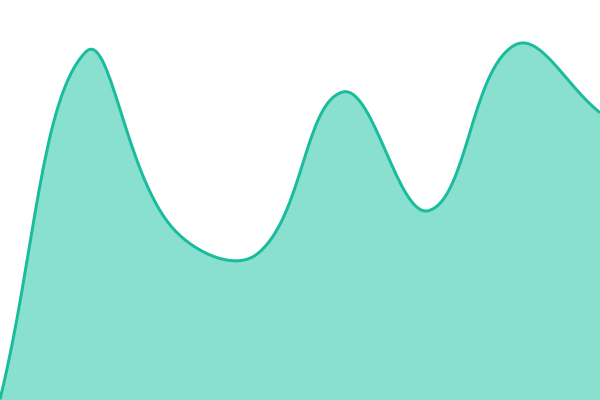
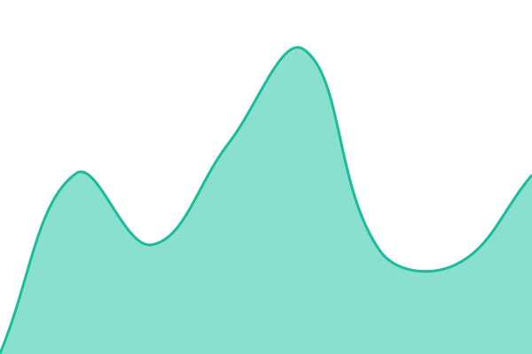

# [📈 Live Status](https://angelcantu84.github.io/statusmoneybox): <!--live status--> **🟩 All systems operational**

This repository contains the open-source uptime monitor and status page for [Moneybox](https://angelcantu84.github.io/statusmoneybox), powered by [Upptime](https://github.com/upptime/upptime).

With [Upptime](https://upptime.js.org), you can get your own unlimited and free uptime monitor and status page, powered entirely by a GitHub repository. We use [Issues](https://github.com/angelcantu84/statusmoneybox/issues) as incident reports, [Actions](https://github.com/angelcantu84/statusmoneybox/actions) as uptime monitors, and [Pages](https://angelcantu84.github.io/statusmoneybox) for the status page.

<!--start: status pages-->
<!-- This summary is generated by Upptime (https://github.com/upptime/upptime) -->
<!-- Do not edit this manually, your changes will be overwritten -->
<!-- prettier-ignore -->
| URL | Status | History | Response Time | Uptime |
| --- | ------ | ------- | ------------- | ------ |
|  [API](https://api.moneybox.business) | 🟩 Up | [api.yml](https://github.com/angelcantu84/statusmoneybox/commits/HEAD/history/api.yml) | 

 4640ms
     
 | 

<a href="https://status.moneybox.business/history/api">94.48%</a>
    

|  [SANDBOX](https://sandbox.moneybox.business) | 🟩 Up | [sandbox.yml](https://github.com/angelcantu84/statusmoneybox/commits/HEAD/history/sandbox.yml) | 

 4651ms
     
 | 

<a href="https://status.moneybox.business/history/sandbox">94.49%</a>
    

|  [DEV](https://dev.moneybox.business) | 🟩 Up | [dev.yml](https://github.com/angelcantu84/statusmoneybox/commits/HEAD/history/dev.yml) | 

 4704ms
     
 | 

<a href="https://status.moneybox.business/history/dev">94.50%</a>
    

<!--end: status pages-->

[**Visit our status website →**](https://angelcantu84.github.io/statusmoneybox)

## 📄 License

- Powered by: [Upptime](https://github.com/upptime/upptime)
- Code: [MIT](./LICENSE) © [Moneybox](https://angelcantu84.github.io/statusmoneybox)
- Data in the `./history` directory: [Open Database License](https://opendatacommons.org/licenses/odbl/1-0/)
